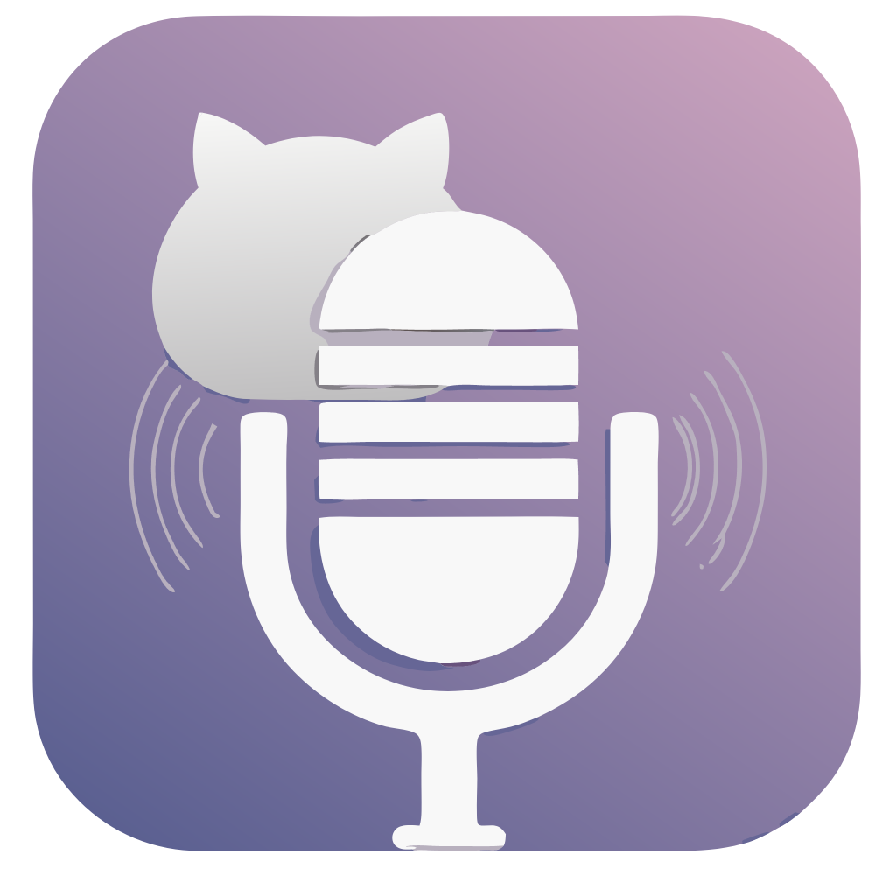

# WhisperDog

<p align="center">
  
</p>

<p align="center">
  
  <a href="LICENSE" target="https://opensource.org/license/mit">
    
  </a>
  
  

[//]: # (  )
</p>

<p align="center"><em>Your attentive audio companion</em></p>

> **Note**: WhisperDog is a rebrand of the [WhisperCat-xblabs](https://github.com/xblabs/whispercat-xb) fork, which was built on the original [WhisperCat](https://github.com/ddxy/whispercat) by [ddxy](https://github.com/ddxy). We are grateful for their foundational work that made this project possible.

WhisperDog is your personal companion for capturing audio, transcribing it, and managing it in one seamless interface. Whether you're taking notes, working on voice memos, or transcribing conversations, WhisperDog makes it simple and efficient. Maximize your productivity with adjustable hotkeys, background operation, and full control over your settings.

---

## Features

### Core Capabilities
- **Record Audio**: Capture sound using your chosen microphone
- **System Audio Capture**: Record computer audio (WASAPI loopback) alongside mic input (Windows)
  - Accurate source attribution using word-level timestamps
  - Transcripts labeled with [User]/[System] based on actual speech timing
- **Automated Transcription**: Process and transcribe your recordings with OpenAI Whisper API
- **Post-Processing Pipelines**: Enhance transcriptions with customizable processing pipelines
- **Global Hotkey Support**: Start/stop recording using global hotkeys (e.g., `CTRL + R`) or sequences (e.g., triple `ALT`)
- **Background Mode**: Minimize to system tray for unobtrusive operation
- **Dark Mode Support**: Switch between light and dark themes

### Advanced Architecture
- **Processing Unit Library** - Create reusable processing units (prompt transformations, text replacements)
- **Pipeline System** - Build custom pipelines by combining units, with enable/disable and reordering control
- **Automatic Pipeline Optimization** - Intelligently merges consecutive same-model API calls, reducing costs by 2-3x
- **Unit Editor** - Streamlined workflow for creating and editing processing units with auto-save

### Visibility & Monitoring
- **Console Execution Log** - Real-time timestamped log showing detailed pipeline execution
- **System-Level Notifications** - OS corner pop-ups for transcription and pipeline completion
- **Log Search** - Search and highlight within console execution logs

### Large File Handling
- **Smart Audio Chunking** - Files >25MB automatically split into chunks for transcription
- **MP3 Compression** - 10x+ compression ratio for large files, extending max recording from 10 to 100+ minutes
- **Format Detection** - Pre-flight analysis identifies format, duration, and available options

### Intelligent Audio Processing
- **Automatic Silence Removal** - RMS-based silence detection removes pauses before transcription
- **MP3 Compression for Large Files** - Automatic conversion using ffmpeg with optimized speech settings
- **Drag & Drop Support** - Drop WAV, MP3, OGG, M4A, FLAC files directly for transcription

### Reliability & Calibration

- **Error Handling & Retry** - Automatic retry with exponential backoff for transient API errors
- **Mic Test Screen** - Real-time VU meter, silence threshold calibration, test recording with playback
- **Pre-Flight Validation** - File size and format validation before API submission
- **Large Recording Warnings** - Configurable threshold alerts for long recordings
- **Recording Indicator** - System tray warning when recording exceeds duration threshold

### Transcription Backends
- **OpenAI Whisper API** - Cloud-based transcription
- **FasterWhisper Server** - Local transcription support
- **Open Web UI** - Web interface integration

---

## Installation

1. Visit the **[Releases Page](https://github.com/xblabs/whisperdog/releases)** for the WhisperDog project.
2. Download the latest version for your operating system and follow the setup instructions.

### Optional: ffmpeg for MP3 Compression

To enable **MP3 compression** for large audio files (recommended for recordings >10 minutes):

**Windows:**
1. Download ffmpeg from [ffmpeg.org/download.html](https://ffmpeg.org/download.html) or use [Chocolatey](https://chocolatey.org/): `choco install ffmpeg`
2. Add ffmpeg to your system PATH

**Linux:**
```sh
# Ubuntu/Debian
sudo apt-get install ffmpeg

# Fedora/RHEL
sudo dnf install ffmpeg

# Arch Linux
sudo pacman -S ffmpeg
```

**macOS:**
```sh
brew install ffmpeg
```

---

## Development & Compilation

### Prerequisites

- **Java Development Kit (JDK) 11 or higher**
- **Apache Maven 3.6+**
- **Git**

### Building from Source

```sh
# Clone the repository
git clone https://github.com/xblabs/whisperdog.git
cd whisperdog

# Build with Maven
mvn clean package -DskipTests

# Run the application
java -jar target/whisperdog-2.2.1-jar-with-dependencies.jar

# Or run with Maven
mvn exec:java -Dexec.mainClass="org.whisperdog.AudioRecorderUI"
```

### Project Structure

```
whisperdog/
├── src/
│   └── main/
│       ├── java/
│       │   └── org/whisperdog/
│       │       ├── AudioRecorderUI.java
│       │       ├── ConfigManager.java
│       │       ├── MainForm.java
│       │       ├── postprocessing/
│       │       ├── recording/
│       │       └── settings/
│      the  └── resources/
│           ├── whisperdog.svg
│           └── icon/
├── pom.xml
└── README.md
```

---

## Usage

1. **Start the Application** - Launch WhisperDog from the JAR or executable
2. **Configure Settings** - Enter your API key, select microphone, configure hotkeys
3. **Start Recording** - Use your configured hotkey or click the record button
4. **Review Transcription** - Text appears automatically after processing
5. **Apply Pipelines** - Optionally run post-processing pipelines on your transcription

---

## Version History

### WhisperDog Releases

#### v2.4.0 - Crash Resilience and Audio Playback Fixes (2026-02-18)

- **Incremental WAV Writer** - Disk-first audio capture survives crashes and unexpected shutdowns
- **Retry UI for Failed Transcriptions** - Recovery dialog to scan and retry failed recordings
- Fixed silence removal min duration being ignored in mic test calibration panel
- Fixed audio playback continuing after navigating away from recordings screen
- Fixed playback race condition when switching between tracks

---

#### v2.3.2 - Audio File Recovery on Transcription Failure (2026-02-17)

- **Critical data-loss bug fix** - Audio files no longer deleted when transcription fails
  - Original WAV, silence-removed WAV, compressed MP3, and system track all preserved
  - Console logs absolute paths for manual recovery
  - Files only cleaned up after confirmed success or explicit user cancellation

---

#### v2.3.1 - Text Copy & Version Display (2026-02-02)

- Version label displayed at bottom of side menu
- Copy button on recording cards to copy transcription to clipboard
- Selectable transcription text (can highlight and copy)

---

#### v2.3.0 - Recordings Panel UX (2026-02-02)

- **Inline Audio Playback** - Play recordings directly in the panel with progress bar and Play/Stop toggle
- **Expandable Transcription** - Click to expand/collapse full transcription text with [more]/[less] toggles
- **Responsive Ellipsis** - Transcription truncation adapts to panel width
- Full transcription storage as `.txt` files alongside `.wav` recordings
- Thread-safe manifest with synchronized load/save and Windows file locking fallback

---

#### v2.2.1 - Recording Retention System and Icon Theming (2026-02-01)

- **Recording Retention System** - Automatically save and manage recordings
  - Keep last N recordings with configurable retention (default 10)
  - Browser panel with metadata: duration, size, source type, transcription preview
  - Play recordings in default audio player or delete with confirmation
  - Open recordings folder directly from UI
- **Icon Theming System** - Runtime icon coloring with semantic naming
  - Context-aware theming: MENU, BUTTON, PANEL, DISABLED modes
  - Light/dark theme support with pure black source SVGs
  - Semantic icon names (mic.svg, sliders.svg) replace numeric indices
- Fixed drag-and-drop cursor feedback for audio/video files
- Improved temp file cleanup routing through ConfigManager
- Enhanced dual-source merge logic with audio content validation

---

#### v2.2.0 - System Audio Capture (2026-01-25)

- **System Audio Capture (WASAPI Loopback)** - Record what you hear from your computer
  - Capture system audio alongside microphone input
  - Configurable loopback device selection
  - Real-time mixing for combined transcription
  - Windows-only (requires XT-Audio library)
- **Word-Level Timestamp Attribution** - Accurate [User]/[System] labels for dual-source recordings
  - Uses OpenAI's `verbose_json` response with word-level timestamps
  - Each word mapped to correct source based on actual timing
- **Audio Device Labels** - Recording screen shows current mic and system audio device names
  - Cross-platform default output detection
  - Auto-refresh on window focus to detect device changes
  - Click label to navigate to Settings
- Upgraded from Java 11 to Java 17 (required by XT-Audio)
- Improved temp file cleanup for long-running sessions
- Dependency updates and code quality fixes

---

#### v2.1.0 - Error Handling & Mic Calibration (2026-01-02)

##### Error Handling & Resilience

- Automatic retry with exponential backoff for transient API errors (429, 500, 502, 503, 504)
- User-friendly error dialogs with actionable guidance
- Pre-submission file validation with supported format checking
- Graceful timeout handling (120s default)

##### Mic Test Screen

- Real-time VU meter for audio level visualization
- Silence threshold calibration slider
- Test recording with playback functionality
- Accessible via Options → Mic Test tab

##### UI/UX Improvements

- **Post-Processing UI Reorganization**
  - Separate "Show section" and "Auto-execute" controls
  - Hidden-but-active indicator when section collapsed but auto-processing enabled
  - Persistent visibility state across sessions
- **Searchable Log Screen**
  - Incremental search with yellow/orange highlighting
  - Previous/Next navigation with match counter
  - Ctrl+F keyboard shortcut
- **Long-Running Process UX**
  - Process progress panel with file path display
  - Copy Path and Open Folder buttons
  - Cancel and Retry functionality for file operations
  - Stage-aware indeterminate progress bar

##### Bug Fixes & Enhancements

- File size validation before API submission
- Dropdown reset hotkey functionality
- Pipeline button disabled state fix
- Large recording warning dialog with configurable threshold
- Visual separators in transcript log for readability
- Minimum speech duration threshold with user prompt
- Recording warning indicator in system tray
- File type validation with supported formats list

---

#### v2.0.0 - Initial WhisperDog Release (2025-12-26)

- Complete rebrand with new identity
- All features from WhisperCat-xblabs preserved
- Updated UI icons and branding

### WhisperCat-xblabs Legacy
See the original [WhisperCat-xblabs repository](https://github.com/xblabs/whispercat-xb) for pre-2.0.0 changelog.

---

## Acknowledgements

WhisperDog is built on the foundation of [WhisperCat](https://github.com/ddxy/whispercat) by [ddxy](https://github.com/ddxy). We are grateful for their original work which made this project possible.

### Original WhisperCat Contributors
- [ddxy](https://github.com/ddxy) - Original creator

### WhisperDog Development
- [xblabs](https://github.com/xblabs) - Fork maintainer, feature development, rebrand

Development assisted by ScaffoldX, an AI-assisted development scaffold for project management and context orchestration.

### Additional Credits

- **[OpenAI Whisper API](https://openai.com/whisper)** for transcription engine
- **[FasterWhisper Server](https://github.com/speaches-ai/speaches/)** for local transcription
- **[SVG Repo](https://www.svgrepo.com/)** for vector graphic resources
- **[FlatLaf](https://www.formdev.com/flatlaf/)** for the modern Swing look and feel
- **[DJ-Raven/flatlaf-dashboard](https://github.com/DJ-Raven/flatlaf-dashboard)** for UI components

---

## License

This project is licensed under the **MIT License**.

---

## Contributing

Contributions to WhisperDog are welcome!
- Open an issue to report bugs or suggest new features
- Submit a pull request to contribute fixes or new functionality

---

## Contact

For questions, feedback, or support, open an **issue** on the [GitHub repository](https://github.com/xblabs/whisperdog).
